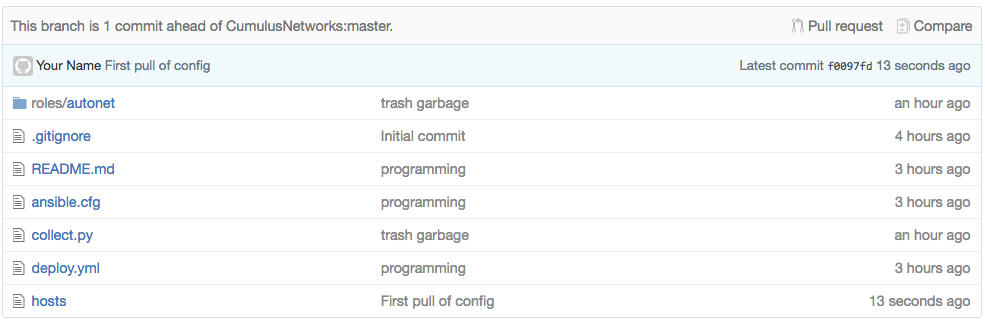
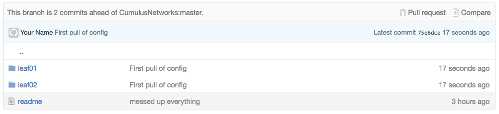
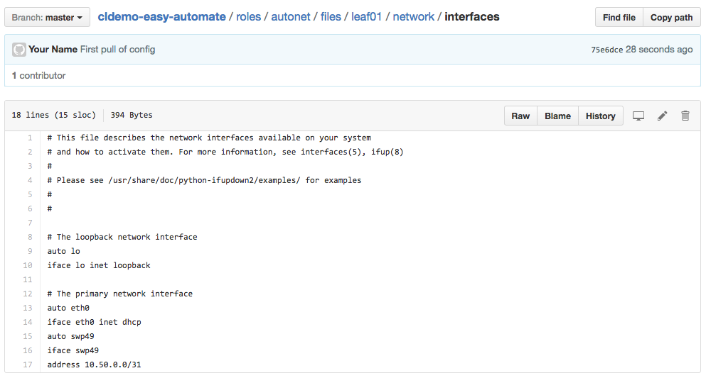
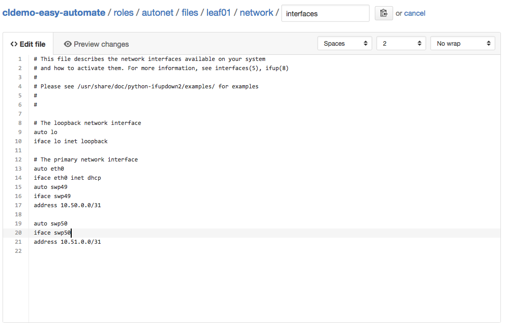
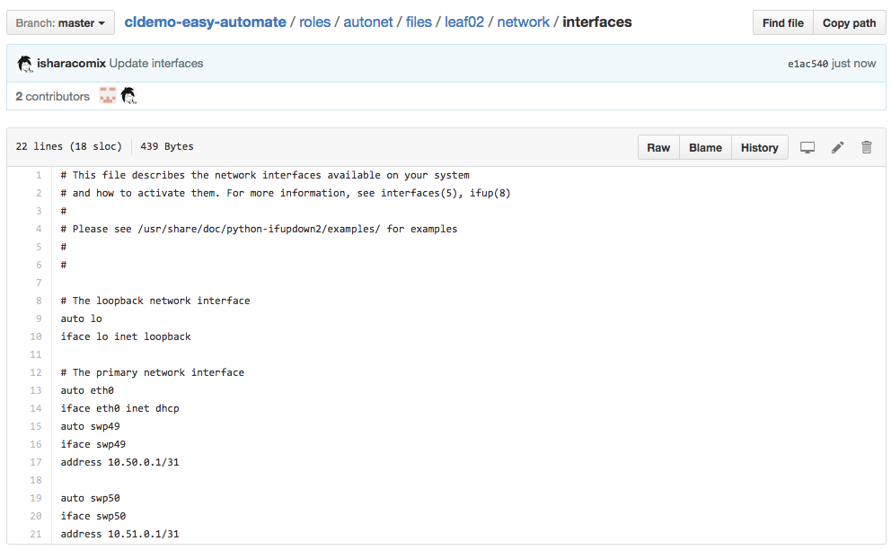

### Demo

First we need to build a virtual topology.

    git clone https://github.com/cumulusnetworks/cldemo-vagrant
    cd cldemo-vagrant
    vagrant up oob-mgmt-server oob-mgmt-switch leaf01 leaf02
    vagrant ssh oob-mgmt-server
    sudo su - cumulus

Now configure the networking.

    ssh leaf01
    sudo su
    echo "auto swp49" >> /etc/network/interfaces
    echo "iface swp49" >>  /etc/network/interfaces
    echo "address 10.50.0.0/31" >> /etc/network/interfaces
    ifup swp49
    exit
    exit
    ssh leaf02
    sudo su
    echo "auto swp49" >> /etc/network/interfaces
    echo "iface swp49" >>  /etc/network/interfaces
    echo "address 10.50.0.1/31" >> /etc/network/interfaces
    ifup swp49
    ping 10.50.0.0
    exit
    exit

On github, create a fork of https://github.com/cumulusnetworks/easyautomate -
this will represent our devops single source of truth.

    git clone https://github.com/MYFORK/easyautomate
    cd easyautomate
    python collect.py leaf01,leaf02
    git config --global user.email "you@example.com"
    git config --global user.name "Your Name"
    git add --all
    git commit -am "First pull of config"
    git push

Look on github and see the configs.

We will now simulate a network failure by destroying our entire topology and
reprovisioning it using our new easyautomate clone.

    vagrant destroy -f
    vagrant up oob-mgmt-server oob-mgmt-switch leaf01 leaf02
    vagrant ssh oob-mgmt-server
    sudo su - cumulus
    git clone https://github.com/MYFORK/easyautomate
    cd easyautomate
    ansible-playbook deploy.yml

After a while, you will become more comfortable with the configuration and not
need to edit configuration on the box anymore. You can just edit files in the
ansible playbook directly. Let's add swp50 by editing the configuration
directly on github's website.

    git pull
    ansible-playbook deploy.yml
    ssh leaf01
    ping 10.51.0.1
